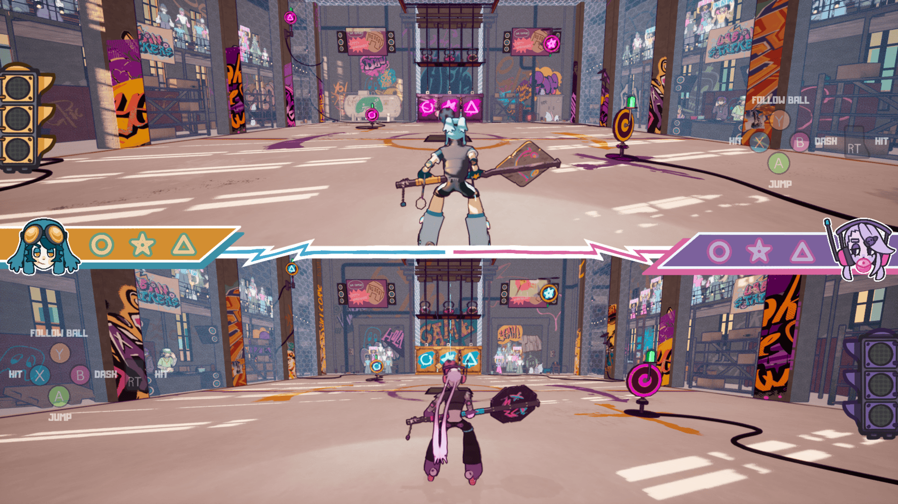
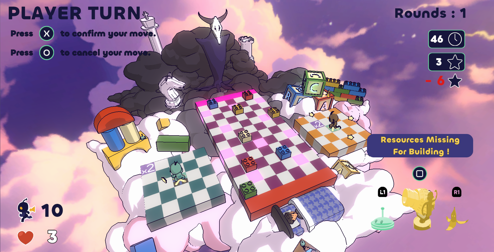

## Bonjour / Hi !

My name is **Raphaël**, and I'm currently finishing my [CS degree at UQÀM](https://etudier.uqam.ca/programme?code=7316).

Not only I always thought that blog were _couwl_, I find gamedev related blog and devlog to be even _couwler_.
That's one of the many reasons pushing me to write markdown on a tuesday night.

The thing is, I found there was a lack for a particular type of blog, then
it was settled that I had to take care of the matter.

## What this blog is about ?

The main topic of this blog is gamedev, more precisely **gameplay programming**.

We can find a lot of blogs about many topics in gamedev, but I found it
way to hard to look for blogs centered around gameplay programming, despite
being one of the most important pillar in game development.

Also, I found that most bloggers were super experienced principal expert, which I love. 
_But_, I also think that having a blog hosted by another upcoming dev, dealing with
both studies and game development could be a nice refresher.

TLDR; **gameplay programming** with a little sugarcoat of slice of life and fun gaming facts.

## My game projects

Classified from the most recent to the oldest. Also, not including all game jams.

### Urban Strikers

A versus sport game with a visually _Jet Set Radio_ vibe and a gameplay-wise _Rocket League_ & _Knockout City_ vibe. 
I've mostly worked as a programmer on the gameloop, UI and player movement.

The game is available for free on itchio : https://ratala321.itch.io/urban-strikers

**Unreal Engine** was used to make this game. Also, it was made during the [**2025 Ubisoft Gamelab**](https://montreal.ubisoft.com/en/our-commitments/education/game-lab-competition/).

### Dreamland bastion

A turn-based tower defense online multiplayer game. 
I've mostly worked as a programmer on all things related online, the building system and the game loop.

The game is available for free on itchio : https://harnm.itch.io/dreamland-bastion

**Unity** was used to make this game. It was made during the [**2024 Ubisoft Gamelab**](https://montreal.ubisoft.com/en/our-commitments/education/game-lab-competition/2024-edition/)

## THE END

Thank you for reading through my first blog post !

If you have any feedbacks, comments or just need to vent, reach me at my email : talaia.gamedev(at)pm.me
