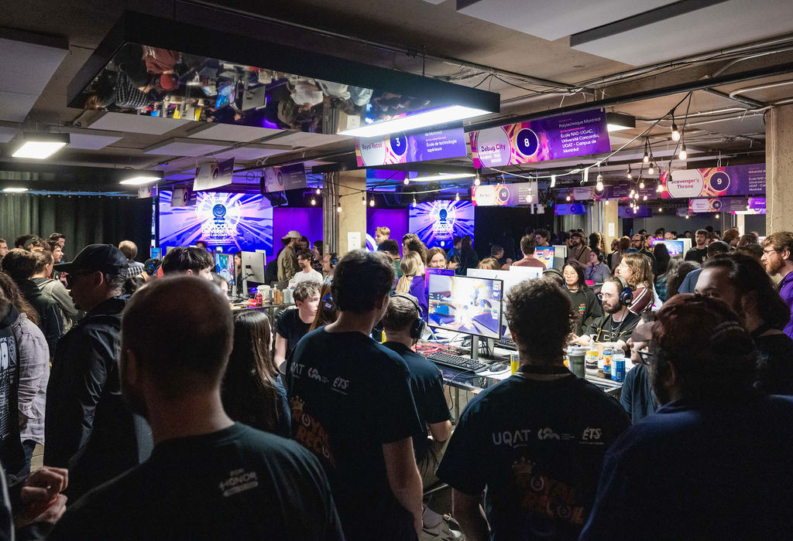

## About the Gamelab

The Gamelab is essentially a **game jam spanning across 10 weeks**.
Usually, a theme and 3 constraints are imposed on the contenders.

Each team can have up to **8 members**. Also, all the teams must be associated
with a university in Québec (the province, not the city). Though members
can be from other universities too, which is great !

On top of that, each team has **two mentors** who work at Ubisoft. Very useful.

In terms of scale, the 2025 Gamelab had **206 participants** shared by **12
universities**. The Gamelab ends with a boot, followed by a gala, where
prize based on 9 categories are given.

## My 2024 participation

I've participated in the 2024 and the 2025 edition of the Ubisoft Gamelab.

My university is not very gamedev oriented (even though things are getting
better in that regard), and I basically learned about the 2024 Gamelab
**the same day** the teams were required to be confirmed.

It was a butthead decision, but the teacher responsible for the
process was super comprehensive. We were originally 3 when we talked to him.
So I started my search for 5 other members.

The first 2 others were pretty easy to find, just two others (great)
programmer friends. But now, I had to find artists and a designer.

I was spamming email all over the place. I was so lucky to stumble upon
two great artists, and one nice designer.

You see, there isn't a ton of game universities with a program
specialized in video game art. It just so happened that the [**NAD**](https://www.nad.ca/)
was just in front of my university. It just so happened that a lot
of people in this school want to do the UbiGamelab, but can't
(especially freshmen).

_Thus, thee found the freshman art makers and the game designer_.
 (he was from [**UQAT**](https://www.uqat.ca/etudes/creation-et-nouveaux-medias/baccalaureat-en-creation-de-jeux-video/) though, but the same logic applies).

We were very inexperienced and one of the constraints was to make a
online multiplayer game. It was a grind, managing both finals and
the last minute sprint to ship the game. It was more importantly a blast !

We did end up being nominated in the game design category, which was
unexpected and very appreciated.

I'm still **very** grateful to my team and my mentors for this journey.

## My 2025 participation

I got to be honest, the stars kind of aligned for me to participate in
the 2025 edition. I was encouraged by my teacher, I had made a promise to
another participant, and one of the artist, that I
worked with during the 2024 edition, just came to me with 4 of his friends.

Let's say that it was _wayyyy_ easier to make a team this time.
I didn't get to choose the programmers I was going to work with this time,
and it was for the better. Both of them are great programmers, and I'm
grateful that I had the chance to work with such **great teammates**.

This time around though, we were balling. We chose Unreal 5 for our engine,
as the artists were more used to it. The team had more overall gamedev and
jams experience.

It ended up as a smoother and more productive process. We felt really
proud about the artistic direction and the amount of polish we had achieved.

Despite that, we sadly didn't turn out to win. Let's say it was more of a
critical success than a commercial one.

## Positive outcomes

You will make friends. Great friends. It's a good opportunity to connect
with current / future industry workers.

Not only that, it's not everyday we can work on a big project
with specialized people as a student. Working alongside designers and
artists is a very different **(much better)** experience.

Let's be honest, it kind of look good on the resume. I think it has
helped me to get into a master in game programming. A discussion for
another time.

It is a learning opportunity, for both hard skills and soft skills.

Lastly, it is super **fun**.

## Negative outcomes

The Gamelab is a **huge** time investment and it will impact your grades.

It can be very stressful at times, as y'all as a team are very likely
to have some hurdles.

By the way, I don't think the Gamelab is a good place
to acquire new knowledge. It's more appropriate to test
the knowledge you already have. In short, I would advise **against**
learning gamedev for the first time there.

## Advice

I think communication is key. As basic as it might sound, getting to know
your colleagues before and during the competition will grease the engine.

For a less basic advice, the prototype is a way to communicate
with your colleagues. Everybody will have an idea about how the game
is, being able to test ideas and show some concrete examples will greatly
help. **Build often**, and send it to everyone on the team. Test the game
during your meeting.

As for the mentors, you should meet them at the same time. Each will bounce
back on what the other said, and it would be more fruitful that way.

Scope management will hinder or bring your success. Be flexible, and
pick your battle. Feedback is good based on the content **and** the timing
of when it is given.

Make a retrospective at the end of the project. You can do it on your own,
but with your team would be great. It is very educational, as you will
get to know blind spots

If possible, choosing one or two easier class might help. You still
have to be a full-time student to participate.

## Conclusion

I think it's important to talk about such subjects, as not everybody knows
about such events, or the possibility to make such events.

I **highly** suggest anybody invested in gamedev to participate. If you
don't have something similar in your area, use the Gamelab as an example
to your local companies ! Employees love to give back to the community,
it's great for the brand, and maybe it's good to find new hires.

Hope it was a good read !
